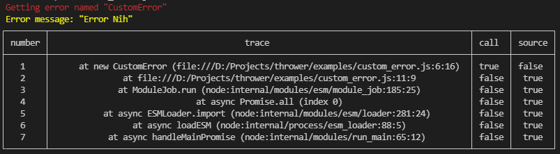

# :boom: Thrower



Javascript throw like, with styles. 😎

```sh
npm install thrower.js
```

See [examples](./examples) for usage examples.

## 📝 License

Thrower is licensed under [MIT License](./LICENSE)
